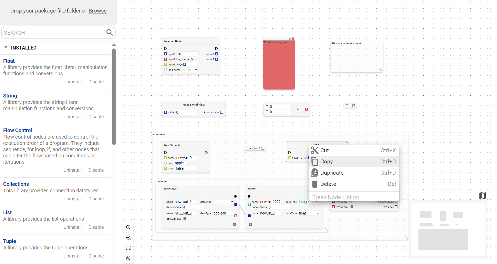

# Visual Programming Language

**Code Generation please check generators folder**

**Knowledge Graph please check ImageTypeConversion folder.**



## Features

* **Node-based Visual Programming Editor:** A user-friendly interactive canvas offering seamless zoom, pan, and node manipulation capabilities, articulately representing a range of operations.
* **Rich Built-in Nodes:** Enhance your designs with our diverse integrated nodes, covering control flow, mathematical operations, variables, function interactions, reroute, and annotation nodes.
* **Advanced User Tools:** Access convenient features like copy, paste, duplicate, and delete, intuitive menus, a detailed minimap, and shortcut keys for faster navigation and operations.
* **Auto Layout:** Employ automated layout adjustments for optimal node alignment and view fitting.
* **Highly Customizable:** Craft unique nodes using a JSON-based specification, tailoring them to your precise needs.
* **Automatic Image Data Transitions via a Configurable Knowledge Graph:** **Semantic Interoperability in Action.** Achieve automatic transitions of image data by searching rules in a user-configurable knowledge graph:, eliminating the need for manual data conversion.
* **Textual Code Generation:** Facilitate source code generation directly from your visual design.
* **Node-Library Panel:** A sophisticated panel displays and manages all installed node libraries, featuring easy installation, uninstallation, activation, and deactivation processes.
* **Integration Ready:** Designed for seamless integration into existing React environments

## Installation

```python
npm i vprcs
```

## Example

An example is [here](https://github.com/Max-ChenFei/Visual-Programming-React-Component-Suite/blob/main/src/index.tsx)

The test example app was bootstrapped using [Create React App](https://github.com/facebook/create-react-app). After cloning the project, execute `npm start` in the console to run the app. You can then view the example in your browser at [http://localhost:3000](http://localhost:3000/).

## Document

For a comprehensive guide and detailed documentation including basic view and navigation, node operations, JSON-based specification for Node Library, code generation, and so on, please visit our [Document](./doc/Document.md).

## Support & Contribution

- Issues: For bug reports and feature requests, please open the GitHub issue.
- Contributing: Pull requests are welcome. For major changes, please open an issue first to discuss the proposed change.

## License

This project is licensed under the GNU General Public License v3.0 license.
